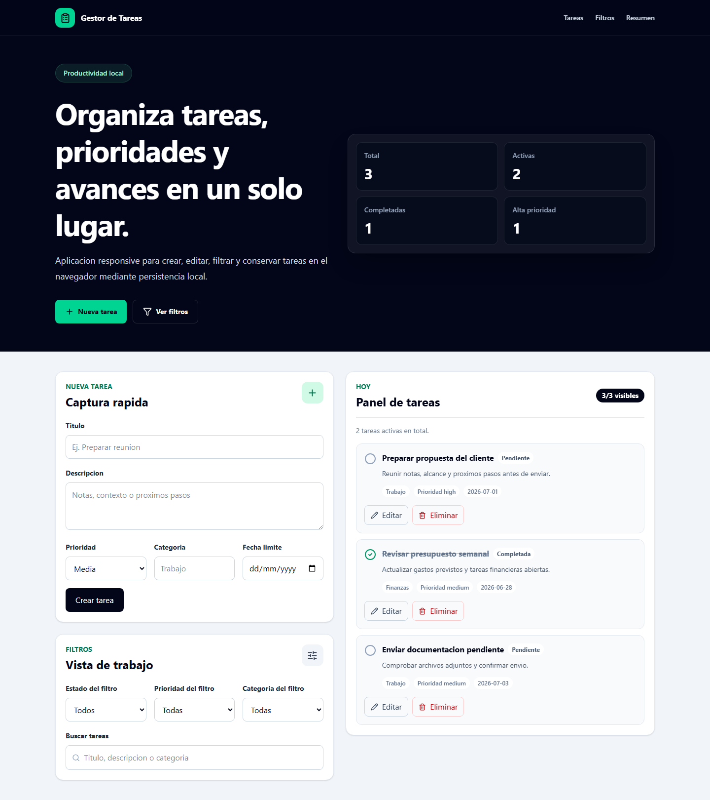
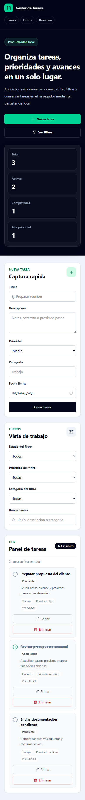

# Gestor de Tareas

Aplicacion responsive para organizar tareas personales o de trabajo con React,
TypeScript y persistencia local en el navegador.

El proyecto funciona como un gestor local de productividad: permite crear,
editar, completar, eliminar, buscar y filtrar tareas sin backend ni cuenta de
usuario.

## Estado

La aplicacion principal esta implementada:

- creacion y edicion de tareas;
- validacion local de titulo y categoria;
- prioridades, categorias, descripcion y fecha limite;
- acciones para completar, reactivar y eliminar tareas;
- filtros por estado, prioridad y categoria;
- busqueda por titulo, descripcion o categoria;
- resumen dinamico de tareas totales, activas, completadas y de alta prioridad;
- persistencia en `localStorage`;
- estados vacios y mensajes accesibles;
- navegacion responsive con enlace para saltar al contenido;
- preparacion para GitHub Pages.

URL publica:

https://alxnrocha.github.io/gestor-tarefas/

## Stack

- React;
- TypeScript;
- Vite;
- Tailwind CSS;
- Lucide React;
- localStorage;
- Git y GitHub.

## Estructura

```text
.
|-- BLUEPRINT.md
|-- DECISIONS.md
|-- README.md
|-- index.html
|-- public/
|-- screenshots/
|   |-- desktop.png
|   `-- mobile.png
|-- src/
|   |-- components/
|   |-- data/
|   |-- types/
|   |-- utils/
|   |-- App.tsx
|   |-- index.css
|   `-- main.tsx
`-- package.json
```

## Ejecucion local

```bash
npm install
npm run dev
```

## Comandos

```bash
npm run dev
npm run lint
npm run build
npm run preview
```

## Capturas

### Escritorio



### Movil



## Deploy

Proyecto preparado para publicacion automatica con GitHub Pages:

[https://alxnrocha.github.io/gestor-tarefas/](https://alxnrocha.github.io/gestor-tarefas/)

## Datos y persistencia

Las tareas se guardan en `localStorage` con una clave versionada. Si no hay
datos guardados o el contenido almacenado no tiene la forma esperada, la
aplicacion vuelve a cargar tareas de demostracion.

## Validacion y accesibilidad

El formulario valida:

- titulo obligatorio;
- categoria obligatoria;
- mensajes de error asociados a los campos;
- estado invalido en controles con error;
- acciones de lista con nombres accesibles;
- resumen y contadores anunciables;
- navegacion por teclado y foco visible;
- enlace para saltar al contenido principal.

## Documentacion

- [Blueprint](./BLUEPRINT.md): alcance, interfaz, datos y plan.
- [Decisiones tecnicas](./DECISIONS.md): criterios de implementacion.

## Autor

Alexandre Rocha
