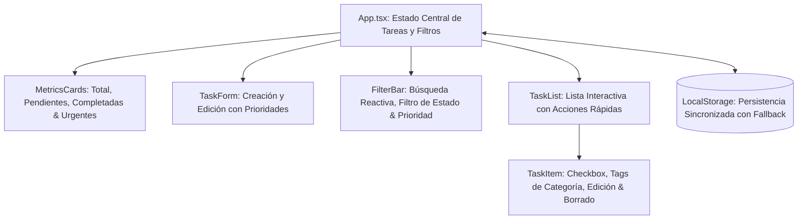

# TaskFlow — Gestor Ágil de Tareas y Productividad

<div align="center">


**Aplicación web interactiva para la organización de flujos de trabajo personales y profesionales con persistencia local en tiempo real, categorización por prioridades y métricas de productividad.**

[🚀 Demo en Vivo](https://alxnrocha.github.io/gestor-tarefas/) • [📂 Repositorio en GitHub](https://github.com/alxnrocha/gestor-tarefas)

</div>

---

## 🏛️ Arquitectura y Flujo de Datos


```mermaid
graph TD
    App[App.tsx: Estado Central de Tareas y Filtros] --> Metrics[MetricsCards: Total, Pendientes, Completadas & Urgentes]
    App --> TaskForm[TaskForm: Creación y Edición con Prioridades]
    App --> FilterBar[FilterBar: Búsqueda Reactiva, Filtro de Estado & Prioridad]
    App --> TaskList[TaskList: Lista Interactiva con Acciones Rápidas]
    TaskList --> TaskItem[TaskItem: Checkbox, Tags de Categoría, Edición & Borrado]
    App <--> Storage[(LocalStorage: Persistencia Sincronizada con Fallback)]
```

---

## ✨ Características Principales

- **Gestión Completa de Tareas (CRUD):** Creación, edición en línea, marcado de completado y eliminación con confirmación.
- **Filtros Avanzados y Búsqueda Instantánea:** Filtrado multicriterio por estado (`Todas`, `Pendientes`, `Completadas`), prioridad (`Baja`, `Media`, `Alta`, `Urgente`) y categorías temáticas.
- **Persistencia en LocalStorage:** Almacenamiento versionado con fallback automático a datos de demostración si está vacío.
- **Métricas Dinámicas de Productividad:** Contadores en tiempo real de tareas totales, tasa de finalización y volumen de alta prioridad.
- **Accesibilidad Completa (WCAG 2.1 AA):** Focos visibles, navegación con teclado y regiones vivas para lectores de pantalla.

---

## 🗂️ Estructura del Proyecto

```text
05-gestor-tarefas/
├── index.html
├── src/
│   ├── components/                # TaskList, TaskForm, MetricsCard, FilterBar
│   ├── types/                     # Interfaces TypeScript
│   ├── App.tsx                    # Componente raíz con hooks de estado
│   └── main.tsx                   # Punto de entrada React 19
├── package.json
├── tsconfig.json
└── vite.config.ts
```

---

## 🚀 Instalación y Puesta en Marcha

### Prerrequisitos
- Node.js `>= 20.0.0`
- npm `>= 10.0.0`

### Ejecución Local
```bash
# 1. Clonar el repositorio
git clone https://github.com/alxnrocha/gestor-tarefas.git
cd gestor-tarefas

# 2. Instalar dependencias
npm install

# 3. Iniciar servidor de desarrollo
npm run dev

# 4. Compilar para producción
npm run build
```

---

## 🛠️ Tecnologías Utilizadas

| Capa | Tecnología | Aspectos Clave |
|---|---|---|
| **Framework** | React 19 | Hooks (`useState`, `useEffect`, `useMemo`), Estado desacoplado |
| **Lenguaje** | TypeScript 5.8 | Modelado riguroso de tareas, prioridades y filtros |
| **Estilos** | Tailwind CSS v4 | Diseño responsive y micro-interacciones |
| **Bundler** | Vite 6.0 | Compilación ultrarrápida y optimización para web |
| **Despliegue** | GitHub Pages | Despliegue estático continuo y optimizado |

---

<div align="center">
  <sub>Desarrollado con dedicación por <a href="https://github.com/alxnrocha">Alex Rocha</a> • Proyecto 05 del Portafolio Profesional Frontend.</sub>
</div>
